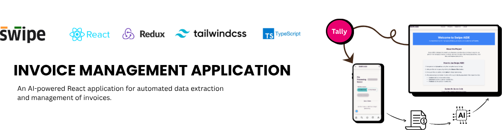

# SWIPE AIDE
## Invoice Management Application

## Overview
An AI-powered React application for automated data extraction and management of invoices. The application processes various file formats (Excel, PDF, Images) and organizes data into Invoices, Products, and Customers sections with real-time synchronization using Redux.

## Features

### 1. File Upload & Data Extraction
- **Supported File Types:**
  - Excel files (.xlsx, .xls)
  - PDF documents
  - Images (PNG, JPEG, GIF)
- **AI-Powered Extraction:**
  - Uses Google Gemini Vision API for intelligent data parsing
  - Handles multi-page PDFs and complex Excel sheets
  - Automated field recognition and categorization

### 2. Application Structure
- **Three Main Tabs:**
  1. **Invoices Tab**
     - Serial Number
     - Customer Name
     - Product Name
     - Quantity
     - Tax
     - Total Amount
     - Date

  2. **Products Tab**
     - Name
     - Quantity
     - Unit Price
     - Tax
     - Price with Tax
     - Discount (optional)

  3. **Customers Tab**
     - Customer Name
     - Phone Number
     - Total Purchase Amount
     - Purchase History

### 3. State Management
- Centralized Redux store for consistent data handling
- Real-time synchronization across tabs
- Automated updates when data changes in any tab

## Technical Architecture

### Dependencies
```json
{
  "@google/generative-ai": "^0.21.0",
  "@reduxjs/toolkit": "^2.3.0",
  "html2canvas": "^1.4.1",
  "pdfjs-dist": "^2.10.377",
  "xlsx": "^0.18.5"
  // ... other dependencies
}
```

### Key Components

#### 1. File Processing
```javascript
processFile(inputFile, dispatch)
```
- Handles different file types
- Converts PDFs and Excel files to images
- Processes through Gemini Vision API
- Updates Redux store with extracted data

#### 2. Data Extraction Logic
```javascript
getDetailsFromInvoice(imageFile, prompt)
```
- Integrates with Google Gemini Vision API
- Uses custom prompts for accurate data extraction
- Returns structured JSON data

#### 3. Data Validation
```javascript
validateAndConvertData(inputString)
```
- Validates JSON structure
- Ensures data completeness
- Handles missing fields
- Type checking for all fields

## Data Flow

1. **File Upload**
   ```
   User Upload → File Processing → Image Conversion → AI Processing
   ```

2. **Data Processing**
   ```
   AI Response → Data Validation → Redux Store Update
   ```

3. **UI Updates**
   ```
   Redux Store → Component Re-render → Tab Updates
   ```

## Implementation Guide

### 1. Setup
```bash
# Install dependencies
npm install

# Set up environment variables
REACT_APP_GOOGLE_GENAI_API_KEY=your_api_key
```

### 2. File Processing Implementation
```javascript
// Example file processing
const handleFileUpload = async (file) => {
  const result = await processFile(file, dispatch);
  if (result.success) {
    // Handle success
  } else {
    // Handle error
  }
};
```

### 3. Redux Store Setup
```javascript
// Store configuration
const store = configureStore({
  reducer: {
    invoices: invoicesReducer,
    products: productsReducer,
    customers: customersReducer
  }
});
```

## Error Handling

1. **File Validation**
   - Unsupported file types
   - Corrupt files
   - Size limitations

2. **Data Validation**
   - Missing required fields
   - Invalid data types
   - Inconsistent data

3. **API Errors**
   - Network issues
   - API rate limits
   - Authentication failures

## Testing

### Test Cases
1. **Invoice PDFs**
   - Single page invoices
   - Multi-page documents
   - Various formats

2. **Mixed File Types**
   - Combined PDF + Images
   - Excel + PDF combinations
   - Multiple file processing

3. **Edge Cases**
   - Missing data fields
   - Different date formats
   - Various currency formats

## Best Practices

1. **Code Organization**
   - Modular component structure
   - Separation of concerns
   - Clear file naming conventions

2. **Performance Optimization**
   - Lazy loading for tabs
   - Optimized file processing
   - Efficient state updates

3. **User Experience**
   - Clear loading indicators
   - Error messages
   - Data validation feedback

## Future Enhancements

1. **Additional Features**
   - Batch processing
   - Export functionality
   - Advanced search and filtering

2. **AI Improvements**
   - Enhanced field recognition
   - Custom training for specific formats
   - Multi-language support

3. **Integration Options**
   - API endpoints for external systems
   - Database integration
   - Cloud storage support

## Contributing

1. Fork the repository
2. Create a feature branch
3. Commit your changes
4. Push to the branch
5. Create a Pull Request

## License

This project is licensed under the MIT License - see the LICENSE file for details.
